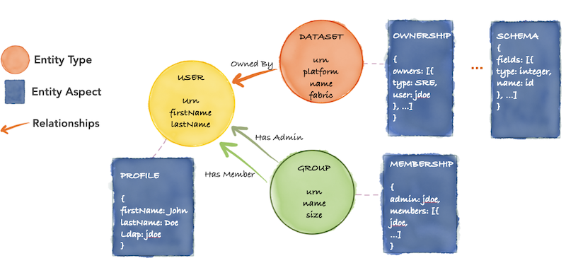
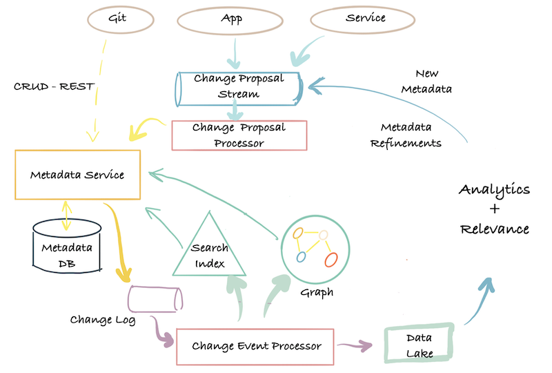
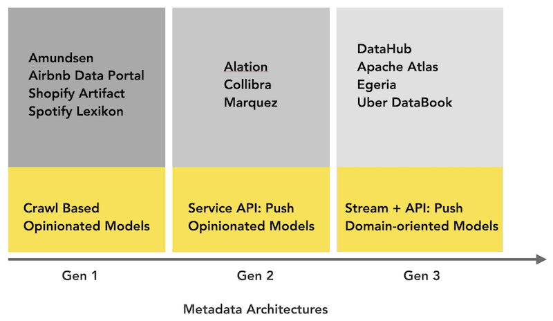

# 常用元数据架构说明

数据发现： 一个问题，多种解决方案

当数据科学家加入一家数据驱动型公司时，他们希望能找到一个数据发现工具（即数据目录），用来找出公司存在哪些数据集，以及如何使用这些数据集来测试新假设和产生新见解。大多数数据科学家其实并不关心这个工具在引擎盖下的实际工作原理，只要能让他们提高工作效率就行。

事实上，有许多数据发现解决方案可供选择：既有可供购买的专有软件，也有特定公司提供的开源软件，还有公司内部开发的软件。在过去几年中，LinkedIn、Airbnb、Lyft、Spotify、Shopify、Uber 和 Facebook 都分享了各自数据发现解决方案的细节。这就引出了一个问题：这些平台各有什么不同，对于打算采用这些工具的公司来说，哪种选择是最好的呢？

数据目录的架构将影响企业从数据中真正提取价值的程度。此外，目录具有粘性，需要很长时间才能在公司内集成和实施。因此，谨慎选择数据发现解决方案非常重要。

## 什么是数据目录？

在深入探讨不同的架构之前，让我们先理清定义。我发现数据目录最简单的定义之一来自 Oracle 网站： “简单地说，数据目录是组织内数据资产的有序清单。它使用元数据来帮助组织管理数据。它还可以帮助数据专业人员收集、组织、访问和丰富元数据，以支持数据发现和治理”。

30 年前，数据资产可能是 Oracle 数据库中的一个表。然而，在现代企业中，我们拥有各种令人眼花缭乱的资产：关系数据库或 NoSQL 存储中的表格、您最喜欢的流存储中的流、您的人工智能系统中的功能、您的度量平台中的度量、您最喜欢的可视化工具中的仪表板等。现代数据目录有望包含所有这些类型数据资产的清单，并使数据工作者在利用这些资产完成工作时更有成效。

为什么需要目录？
在决定购买或采用特定的数据目录解决方案或构建自己的数据目录之前，首先应该问一问自己想通过数据目录为企业带来什么。与此相关的一个重要问题是，你想在数据目录中存储哪些类型的元数据，因为这直接影响到你可以启用的用例类型。

下面是一些常见的使用案例及其所需的元数据类型示例：

- 搜索和发现： 数据模式、字段、标签、使用信息
- 访问控制： 访问控制组、用户、策略
- 数据脉络(Data Lineage)： 管道执行、查询、API 日志、API 架构
- 合规性： 数据隐私/合规性注释类型的分类标准
- 数据管理： 数据源配置、摄取配置、保留配置、数据清除策略（例如，针对 GDPR 的 “被遗忘权”）、数据导出策略（例如，针对 GDPR 的 “访问权”）。
- 人工智能可解释性、可重复性： 特征定义、模型定义、训练运行执行、问题陈述
- 数据操作：管道执行、处理的数据分区、数据统计
- 数据质量： 数据质量规则定义、规则执行结果、数据统计

一个有趣的现象是，每个用例通常都会带来自己的特殊元数据需求，但同时也需要与其他用例带来的现有元数据进行连接。当我们深入探讨这些数据目录的不同架构及其对成功的影响时，我们会再次提到这一观点。

## 第三代架构： 事件源元数据

第三代元数据架构的关键见解是，基于 “中央服务” 的元数据解决方案难以跟上企业对元数据用例提出的要求。要解决这个问题，必须满足两个需求。首先，元数据本身必须是自由流动、基于事件和可实时订阅的。其次，元数据模型必须支持随着新扩展和新增内容的出现而不断演进，而不会受到中央团队的阻挠。这将允许元数据始终可被多种类型的消费者大规模消费和丰富。

步骤 1：面向日志的元数据架构

元数据提供商可以根据自己的偏好，向基于流的 API 推送元数据，或者对目录的服务 API 执行 [CRUD](https://en.wikipedia.org/wiki/Create,_read,_update_and_delete) 操作。由此产生的元数据突变将反过来生成元数据变更日志。该元数据日志可以自动、确定地具体化到适当的存储和索引（如搜索索引、图索引、数据湖、olap 存储）中，以满足所有查询模式的需要。如下图所示，这样就形成了一个为现代企业准备就绪的非捆绑元数据数据库架构。既然日志是元数据宇宙的中心，在出现任何不一致的情况下，您都可以随意引导图索引或搜索索引，并确定性地修复错误。

步骤 2：面向领域的解耦元数据模型

除了 “流优先” 架构外，第三代目录还支持企业协作定义可扩展的强类型元数据模型和关系。强类型化非常重要，因为如果没有强类型化，我们就会在元数据存储中存储最小公分母的通用属性包。这样，元数据的程序化消费者就无法在处理元数据时保证向后兼容性。

在下面的元数据模型图中，我们使用 DataHub 的术语 “实体类型”、“方面”和 “关系”来描述包含三种实体的图： 数据集、用户和组。不同的团队可将所有权、简介等不同方面附加到这些实体上，从而在这些实体类型之间创建关系。请注意，描述这些图模型的方法多种多样，从基于 [RDF](https://en.wikipedia.org/wiki/Resource_Description_Framework) 的模型到完整的 ER 模型，再到像 DataHub 所用的[自定义混合方法](https://github.com/linkedin/datahub/blob/master/docs/how/metadata-modelling.md)。

这种建模方式使团队能够通过添加特定领域的扩展来发展全局元数据模型，而不会受到中央团队的瓶颈限制。例如，合规团队可能会签入所有权方面，而核心元数据团队可能会签入数据集实体的模式方面。同时，数据摄取团队可能会为数据集实体设计并签入 ReplicationConfig 方面。所有这些对模型的添加都可以独立进行，摩擦点极少。当然，在将核心实体类型引入图之前，我们需要对它们进行管理并达成一致。

### 好处

通过这种演进，客户可以根据自己的需求，以不同的方式与元数据库对接。他们可以获得基于流的元数据日志（用于摄取和更改消费）、元数据低延迟查询、元数据属性全文和排序搜索能力、元数据关系图查询以及完整的扫描和分析能力。在不影响一致性或新鲜度的情况下，可以在该元数据流的基础上构建不同的用例和应用，并对核心元数据模型进行不同的扩展。您还可以将这些元数据与您偏好的开发人员工具（如 git）集成，在编写代码的同时编写元数据并对其进行版本控制。通过低延迟处理元数据变更日志，或将压缩后的元数据日志作为数据湖上的表格进行批量处理，可以对元数据进行完善和丰富。

下图展示了这一架构的完整实现版本：

任何全球性的企业元数据需求，如全球性的生命周期管理、审计或合规性，都可以通过构建工作流来解决，工作流可以以流的形式或批处理的形式查询这些全球性元数据。

“良好的元数据架构” 与 “良好的数据架构”极为相似

一个好的第三代元数据架构实施的典型标志是，你总是能够以最详细的形式读取最新的元数据并对其采取行动，而不会丢失一致性。在 LinkedIn，当我们从 WhereHows（第二代）过渡到 DataHub（第三代）时，我们发现我们能够极大地提高元数据的可信度，从而使元数据系统成为企业的中心。现在，元数据系统正逐步成为数据工作者研究新假设、发现新指标、管理现有数据资产生命周期等工作的起点。

### 缺点

先进性往往与复杂性并存。第三代元数据系统通常会有几个活动部件，需要对其进行设置才能使整个系统运转良好。拥有少量数据工程师的公司可能会发现，将一个简单的使用案例付诸实践所需的工作量让他们望而却步，不知道最初投入的时间和精力是否值得长期回报。不过，像 DataHub 这样的第三代元数据系统已经开始在可用性和开箱即用体验方面取得重大进步，以确保这种情况不会发生。

## 总结

在 LinkedIn，DataHub 的部署包括数据集、模式、流、合规性注释、GraphQL 端点、指标、仪表盘、功能和人工智能模型，使其在规模和战备方面真正成为第三代元数据系统。它每天通常要处理多达 1000 多万个实体和关系变更事件，总计索引了 500 多万个实体和关系，同时以低毫秒级的 SLA 为操作元数据查询提供服务，为我们的所有员工实现数据生产力、合规性和治理工作流。

下面是当今元数据环境的一个简单可视化示意图。

当然，这只是目前不同系统的现状快照。随着企业对元数据的需求不断增长，第 3 代系统可能会进一步整合和更新。

一个好的架构就够了吗？

通过 DataHub 实施的第三代架构，我们似乎已经获得了一个良好的元数据架构，它具有可扩展性，能很好地满足我们的多种使用情况。这个领域还有其他问题需要解决吗？简短的回答是 “是的”。第三代元数据架构确保您能够以最具可扩展性和灵活性的方式集成、存储和处理元数据。但这还不够。

“让元数据发挥作用比把元数据放在一起更难”。
首先需要定义正确的元数据模型，真正捕捉对企业有意义的概念。然后，您需要一个人工智能支持的途径，从这个完整、可靠的数据资产清单过渡到可信的元数据知识图谱。这将使您真正释放企业的生产力和治理能力。
